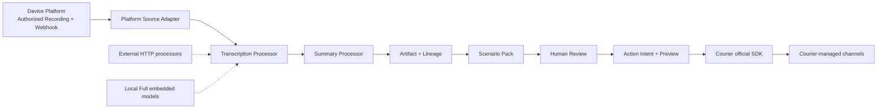

# Voicecan Studio 架构

## 产品边界

Voicecan Studio 是一个应用，External 与 Local Full 是它的两种 Composition Root。Device Platform 与 Studio 的职责严格分开：

| Device Platform | Voicecan Studio |
| --- | --- |
| 设备身份、能力、命令与固件 | 从授权 Recording 构建应用结果 |
| 录音索引、状态、授权与 Download Grant | Processor 编排、Revision 与 Artifact 血缘 |
| Webhook 事件和公开 SDK Contract | Scenario Pack、人工审核与 Action Intent |
| Platform 级运维和设备同步 | 通过第三方官方 SDK 执行动作 |

Studio 不提供设备列表、设备诊断、设备命令或 Platform 运维界面。`src/platform/` 是唯一允许导入 `@voicecan/server-client` 的位置，只把公开 Recording/Webhook Contract 转为应用端口。



## 稳定内核与扩展面

`TranscriptionJob` 是聚合根。每个派生结果都绑定 Recording resource version 和上游 Revision：

```text
Recording snapshot
  └─ Transcript Artifact rN
       └─ Summary Artifact rN
            └─ Scenario Result Artifact rN
                 └─ Review rN
                      └─ Action Intent rN → Delivery
```

上游修改会把下游标记为 stale、撤销审核，并取消尚未执行的 Action Intent。Action 采用“创建预览 → 人工确认执行”两阶段语义，并用 Recording、Scenario Revision、Target 与 Target Version 生成幂等键。

面向开发者有三类首选扩展：

- Processor Stage：实现现有 `TranscriptionProcessor` 或 `SummaryProcessor` Port，在 Composition Root 选择。
- Scenario Pack：纯函数式 Manifest + Projection，把已验证 Artifact 映射为某个应用场景的结构化结果。
- Integration：先定义应用 Port，再在 Infrastructure 使用第三方官方 SDK；SDK 类型不进入领域 Contract。

Courier 是当前动作执行平台。渠道、模板、路由、偏好、重试和日志都在 Courier 管理，Studio 不增加 SMTP、Slack、Teams、SMS 等渠道 Transport。

## 代码地图

```text
studio/src/
├── platform/              # Device Platform 公开 SDK 的唯一适配层
├── processors/            # 可选 Processor 扩展
├── scenarios/             # 纯 Scenario Pack、Manifest、Registry
├── integrations/          # 第三方官方 SDK Adapter
├── kernel/                # Artifact、Manifest 与稳定内核
├── capabilities/          # 内部事务边界，不是产品功能清单
├── service.ts             # 聚合编排、Revision、Review、Action Intent
├── runtime.ts             # External Composition Root
├── main-local.ts          # Local Full Composition Root
├── web.ts                 # HTTP API
└── studio-page.ts         # 原生 Web UI
```

Domain 与 Scenario 不得依赖 Node、SQLite、HTTP、UI 或厂商 SDK。`npm run check:architecture` 强制 SDK 边界和 Scenario 纯度。

## 持久化与安全

SQLite 使用单进程事务存储，并为 Recording、Transcript、Summary、Artifact、Scenario Revision、Scenario Confirmation、Action Intent、Target 和 Delivery 提供关系投影。运行目录中的音频和内容数据按保留策略删除。

日志不得包含 Application Token、Webhook Secret、Processor/Courier Key、临时 URL、音频、Transcript 或 Payload。Download Grant 只在 Worker 获得执行权且 Processor、音频工具与存储健康后创建，且从不持久化。

## 扩展命令

```bash
npm run generate:scenario -- --name customer-follow-up --title "Customer Follow-up"
npm run generate:processor -- --name vendor-asr --kind asr
npm run generate:integration -- --name ticketing --sdk @vendor/official-sdk
npm run check:architecture
npm run ci
```

完整步骤见 [AI Start Here](../studio/docs/ai-development/START-HERE.md) 和 [Extension Catalog](../studio/docs/ai-development/EXTENSION-CATALOG.md)。
